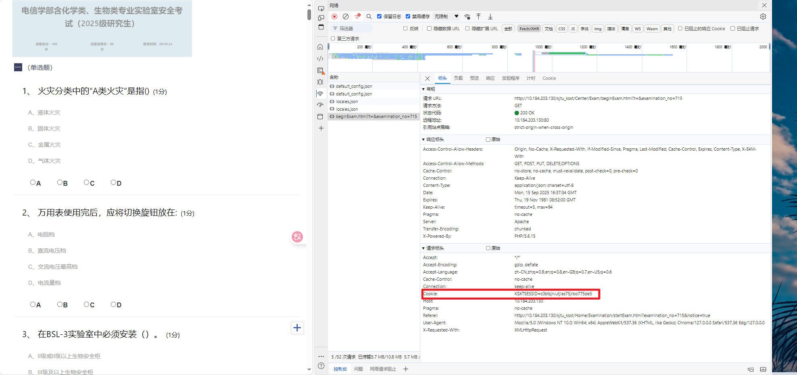
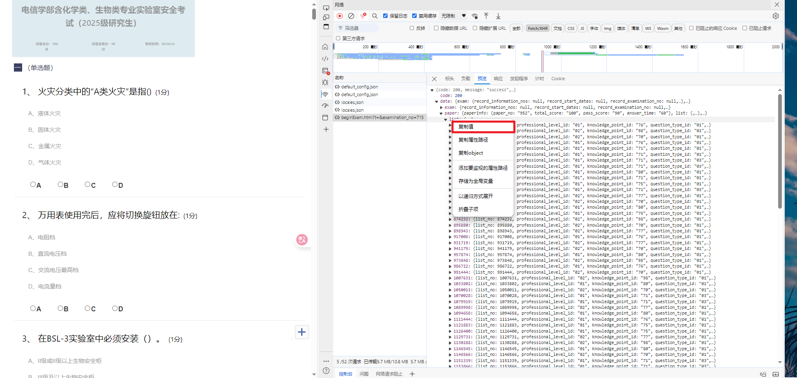

# xjtuSecure: xjtu实验室安全教育辅导

## 使用手册

### 手机夸克 + 大模型（豆包...）

问：为什么选择这样的方法？

答：因为电脑浏览器有js，直接复制不了题目文字，导致不方便复制粘贴丢给ai作答。如果截屏丢给AI作答，准确率大幅下降！

使用方法：
1. 使用手机夸克，切换成电脑模式（百度搜索一下，换个设置即可）
2. 登录对应的网站，扫码答题
3. 手机夸克可以复制粘贴文字，一次复制40道左右的题目丢到豆包里面
4. 完成作答，基本能到90分以上！

### 答题辅助脚本

学校有题库，可以利用题库爬取答案，作答起来会简单很多。

不过需要一定的配置环境和前端小知识

1. 登录系统，F12打开问卷后刷新
2. 在config中配置cookie

3. 复制关键信息,在config中配置context

4. 运行main，查看ans即可

最后呈现结果和题干一致。注意：其他测试可能存在打乱顺序的操作...
```txt
########################################
题目 1
########################################
题库编号: 359035
题目编号: 207165
题目类型: 单选题

题干: 火灾分类中的“A类火灾”是指()

选项:
  A: 液体火灾
  B: 固体火灾
  C: 金属火灾
  D: 气体火灾

正确答案: B (固体火灾)

----------------------------------------

########################################
题目 2
########################################
题库编号: 407782
题目编号: 230575
题目类型: 单选题

题干: 万用表使用完后，应将切换旋钮放在:

选项:
  A: 电阻档
  B: 直流电压档
  C: 交流电压最高档
  D: 电流量档

正确答案: C (交流电压最高档)
```

### ~~自动化答题脚本（失败）~~

`failure`文件夹包含失败的代码。

本来想写一个全自动的脚本完成答案的。抓包+花费了一下午编码尝试。但是由于作答次数有限，抓包后续失败了。实在分析不出来post请求，**如果有分析出来的，可以提pr。**

我原本的思路：
1. 获取题目列表 + 通过题库获取题目对应的答案
2. 构造提交post链接的答案表单
