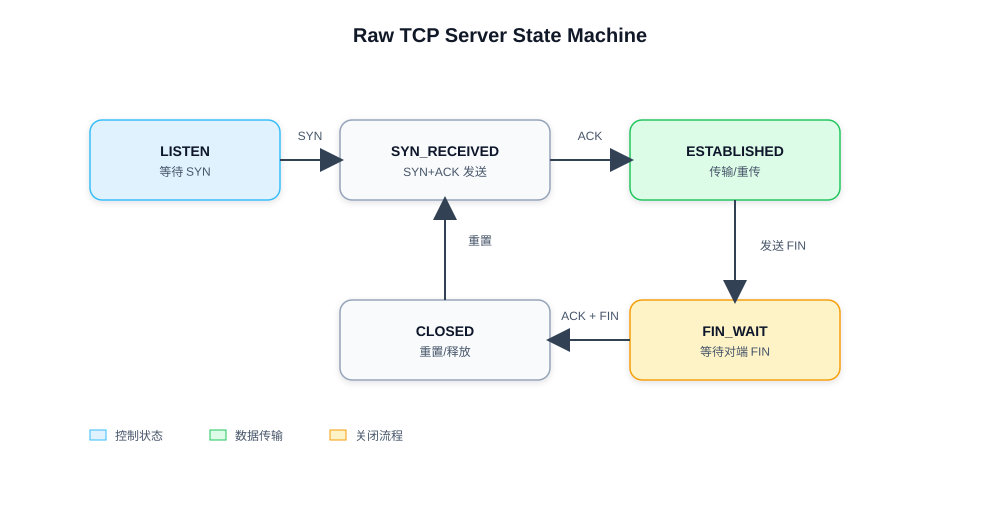
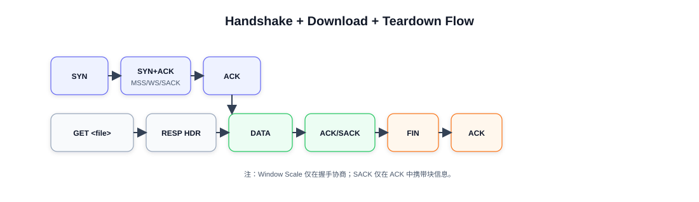
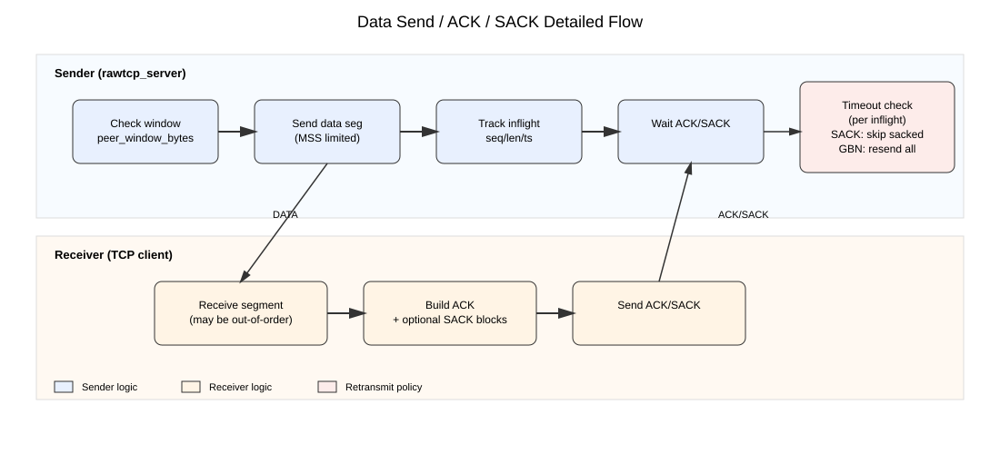

# Internet课程-编程实验报告

## 一、实践目的
1. 理论与原理层面：深入理解 TCP 协议的核心原理（包括三次握手、可靠传输、序列号 / 确认号机制、重传、四次挥手等），掌握 IP 分组传输服务的底层逻辑，厘清原始 Socket 与系统封装 TCP Socket 的本质区别，建立传输层协议的底层认知框架。
2. 实践技能层面：掌握原始 Socket 的使用方法，能够手动构造 IP/TCP 数据包、实现简易 TCP 协议的核心机制；完成文件下载服务端（模拟 TCP）与客户端（标准 TCP）的设计与开发，提升网络编程、数据封装 / 解析、异常处理等实操能力。
3. 工程能力层面：熟悉从需求分析、技术方案设计、代码实现到功能测试的完整开发流程，掌握网络程序调试、抓包验证等工具的使用方法；通过文档撰写（如技术方案、测试报告）和问题排查，培养工程实践与逻辑表达能力。
4. 问题解决层面：验证基于原始 Socket 模拟 TCP 协议的可行性，在实现过程中分析并解决数据丢包、乱序、重传等实际问题，总结模拟 TCP 与标准 TCP 的适配要点，反思实践中的不足并提出优化方向。

## 二、实践内容——具体功能需求
### 1. 功能需求概述
本次实践核心目标是设计并实现一套文件下载/上传系统，系统由服务端和客户端两部分组成。其中服务端基于原始 Socket 手动模拟 TCP 协议核心机制（不使用系统现有 TCP 流服务，仅依赖 IP 分组传输服务），客户端基于系统标准 TCP 协议开发；最终实现客户端向服务端发送文件下载或上传请求，服务端响应请求并通过模拟 TCP 完成文件分块传输或接收，客户端完成保存或读取发送，验证模拟 TCP 协议的可行性与可靠性。

### 2. 核心功能需求
#### 功能 1：服务端模拟 TCP 协议核心功能

具体描述：服务端使用原始 Socket，手动实现 TCP 协议核心机制，完成与标准 TCP 客户端的连接建立、可靠数据传输、连接释放，不调用系统封装的 TCP 相关 API（如 connect（）、accept（）、send（）、recv（）等）。

输入：客户端通过标准 TCP 发送的 SYN 连接请求、ACK 确认报文、文件下载请求报文、FIN 断开连接请求。

输出：服务端向客户端发送的 SYN+ACK 应答报文、ACK 确认报文、文件数据报文（带序列号）、FIN 断开连接报文。

业务逻辑：服务端监听指定端口，捕获客户端发送的 IP 分组；解析分组中的 TCP 头部信息，识别 SYN、ACK、FIN 等标志位；完成三次握手建立连接，接收客户端下载请求；按序列号分块发送文件数据，监听客户端确认报文，实现丢包检测与重传；接收客户端 FIN 请求，完成四次挥手释放连接。

#### 功能 2：服务端文件下载服务功能
具体描述：在模拟 TCP 协议的基础上，服务端实现文件读取、下载请求解析、文件数据分块与发送功能，响应客户端的文件下载请求，确保文件数据可靠传输至客户端。

输入：客户端发送的文件下载请求（包含目标文件名）、客户端对文件数据的 ACK 确认信息。

输出：服务端读取的本地目标文件数据（分块封装为 TCP 报文）、请求响应报文（确认请求有效/无效）。

业务逻辑：服务端在建立连接后，解析客户端发送的下载请求，提取目标文件名；检查本地是否存在该文件，若不存在则返回无效请求响应，若存在则打开文件并按固定大小分块；将每块数据封装为带有序列号的 TCP 报文，通过模拟 TCP 发送至客户端；等待客户端的 ACK 确认，若超时未收到确认则重传对应数据块，直至所有文件数据发送完成。

#### 功能 3：标准 TCP 客户端文件下载功能
具体描述：客户端使用系统标准 TCP 协议（调用系统 TCP 原生 API），与服务端模拟的 TCP 建立连接，发送文件下载请求，接收服务端传输的文件数据，完成数据重组与本地保存。

输入：用户输入的目标文件名、服务端发送的文件数据报文、连接应答报文。

输出：向服务端发送的 SYN 连接请求、文件下载请求、ACK 确认报文、FIN 断开连接请求；本地保存的完整目标文件。

业务逻辑：客户端通过系统 TCP Socket 与服务端指定端口建立连接（依赖系统 TCP 完成三次握手）；向服务端发送包含目标文件名的下载请求；接收服务端传输的文件数据，按序列号重组数据（依赖系统 TCP 保证有序接收）；将重组后的完整数据保存为本地文件，文件保存完成后，向服务端发送 FIN 请求，完成四次挥手释放连接。

#### 功能 4：文件上传功能
具体描述：客户端读取本地文件并向服务端发起上传请求，服务端校验保存路径与文件状态后允许上传；随后客户端通过标准 TCP 按 MSS 分块发送文件数据，服务端基于模拟 TCP 的序列号/ACK 机制按序重组并写入本地文件，完成可靠上传。

输入：客户端上传请求（目标保存路径 + 文件大小）、客户端发送的文件数据分片、服务端响应头。

输出：服务端上传应答（状态码 + 允许上传长度）、服务端保存的完整文件；连接释放报文。

业务逻辑：客户端发送 `PUT <filename>\n` 与文件大小，服务端检查路径合法性与文件是否已存在；若允许上传则返回应答并开始接收数据，收到乱序段时缓存并通过 ACK/SACK 提示客户端，按序写入；所有数据接收完成后等待客户端 FIN，服务端 ACK 并发送 FIN 释放连接。

### 3. 非功能需求
1. 性能需求：支持至少 20MB 大小文件的完整下载/上传，数据传输无丢失、无乱序，超时重传时间设为 1-3 秒。
2. 稳定性需求：服务端可稳定监听、响应请求，客户端与服务端通信及文件下载/上传过程顺畅，可重复操作。
3. 兼容性需求：客户端适配 Linux 系统，服务端适配 Linux，可正常通信。

## 三、技术方案
### 1. 总体设计思路
本项目采用“标准 TCP 客户端 + 原始 Socket 服务端”的不对称架构。服务端以 `AF_INET/SOCK_RAW/IPPROTO_TCP` 直接收发 IP 分组，开启 `IP_HDRINCL`，自行构造 IP/TCP 头部，实现 TCP 核心机制；客户端使用系统标准 TCP，实现与服务端的互通并完成文件下载/上传。

整体流程如下：
1. 服务端监听端口并接收来自客户端的 SYN。
2. 服务端发送 SYN+ACK，客户端回复 ACK，完成三次握手。
3. 客户端发送 `GET <filename>\n` 或 `PUT <filename>\n + size` 请求。
4. 服务端返回应用层响应头（状态码 + 长度）。
5. 下载场景：服务端分段发送文件数据并依据累计 ACK 重传。
6. 上传场景：客户端分段发送文件数据，服务端按序重组写入并回 ACK/SACK。
7. 数据传输结束后完成四次挥手关闭连接。

为便于理解协议状态与整体通信流程，补充状态机图与流程图如下。

图 3-1 原始 Socket TCP 服务端状态机：


图 3-2 握手 + 下载 + 关闭流程图：


图 3-3 数据发送/ACK/SACK 细节子流程图：


### 2. 关键技术选型
- 语言：C（C11 标准）。
- 平台：Linux。
- 关键库：`netinet/ip.h`、`netinet/tcp.h`、`arpa/inet.h`、`poll`、`pread`。
- 原始 Socket 关键选项：`IP_HDRINCL`。
- 辅助工具：`iptables`（可选，用于屏蔽内核 RST），Wireshark（抓包验证）。

### 3. 核心算法与协议细节
1) 校验和计算

- IP 头校验和用于保证 IP 头完整性。
- TCP 校验和使用伪首部（源/目的 IP、协议号、TCP 长度）+ TCP 头 + 负载计算，保证 TCP 报文合法。

代码片段（TCP 校验和构造）：
```c
uint16_t rawtcp_tcp_checksum(const struct iphdr *ip,
                             const uint8_t *tcp_hdr, int tcp_hdr_len,
                             const uint8_t *payload, int payload_len) {
    struct rawtcp_pseudo_header pseudo;
    uint32_t tcp_len = (uint32_t)(tcp_hdr_len + payload_len);
    uint8_t buf[2048];
    pseudo.src_addr = ip->saddr;
    pseudo.dst_addr = ip->daddr;
    pseudo.zero = 0;
    pseudo.protocol = IPPROTO_TCP;
    pseudo.tcp_len = htons((uint16_t)tcp_len);
    memcpy(buf, &pseudo, sizeof(pseudo));
    memcpy(buf + sizeof(pseudo), tcp_hdr, (size_t)tcp_hdr_len);
    if (payload_len > 0) {
        memcpy(buf + sizeof(pseudo) + (size_t)tcp_hdr_len, payload, payload_len);
    }
    return rawtcp_checksum(buf, sizeof(pseudo) + tcp_len);
}
```

2) 三次握手与连接建立

- 服务端接收到 SYN 后记录 `client_isn`，设置 `rcv_nxt = seq + 1`，生成 `snd_iss`，发送 SYN+ACK。
- 收到客户端 ACK（`ack_seq == snd_iss + 1`）后进入 `ESTABLISHED`。

关键代码逻辑（握手片段）：
```c
if (tcp->syn) {
    ctx->client_isn = seq;
    ctx->rcv_nxt = seq + 1;
    ctx->snd_iss = (uint32_t)(rawtcp_now_ms() & 0xFFFFFFF0U);
    ctx->snd_nxt = ctx->snd_iss + 1;
    ctx->state = STATE_SYN_RECEIVED;
    send_synack(ctx);
}
```

3) TCP 选项协商（MSS/Window Scale/SACK）

- 服务端在 SYN/SYN+ACK 中携带 MSS、SACK Permitted、Window Scale 选项。
- 解析客户端 SYN 的 MSS 与 Window Scale，取双方 MSS 的最小值作为有效 MSS。
- 仅在握手阶段协商 Window Scale，后续窗口字段按 `2^scale` 扩大。

关键代码逻辑（构造 SYN 选项）：
```c
int opt_len = rawtcp_build_syn_options(ctx->local_mss,
                                       ctx->sack_enabled,
                                       ctx->local_ws,
                                       options, sizeof(options));
rawtcp_send_packet_ex(..., TH_SYN | TH_ACK, advertised_window(ctx),
                      options, opt_len, NULL, 0);
```

4) 可靠传输与重传机制（简化 Go-Back-N + SACK 优化）

- 将“响应头 + 文件内容”视为连续字节流，按 MSS 分段。
- 维护固定窗口段数（默认 16 段）。
- 使用累计 ACK 前移窗口，超时触发重传。
- 启用 SACK 时，ACK 报文携带已接收的非连续区间，服务端仅重传未被 SACK 的段。

关键代码逻辑（发送窗口与重传）：
```c
while (ctx->inflight_count < ctx->window_segs &&
       ctx->next_send_offset < ctx->data_total_len) {
    uint16_t seg_len = (remaining > ctx->mss) ? ctx->mss : remaining;
    rawtcp_send_packet(..., TH_ACK | TH_PUSH, payload, seg_len);
    ctx->inflight[ctx->inflight_count++] = (struct inflight_seg){...};
    ctx->next_send_offset += seg_len;
}
```

5) 连接释放（简化四次挥手）

- 下载：服务端在确认所有数据 ACK 后发送 FIN，客户端 ACK 并发送 FIN，服务端 ACK 后释放连接。
- 上传：客户端发送完数据后发送 FIN，服务端 ACK 并发送 FIN，客户端 ACK 后释放连接。

6) 应用层协议

- 下载请求：`GET <filename>\n`
- 上传请求：`PUT <filename>\n` + 8 字节文件大小（大端）
- 响应头：1 字节状态码（0 成功 / 1 失败）+ 8 字节长度（大端）
- 下载成功时紧接文件数据；上传成功时服务端进入接收状态；失败仅返回头部。

### 4. 系统架构与模块划分
- Raw TCP 基础模块 `rawtcp.c/.h`：构造 IP/TCP 头、校验和、发送原始包。
- Raw TCP 服务端模块 `rawtcp_server.c`：协议状态机、请求解析、文件读取、分段发送、窗口与重传管理。
- 标准 TCP 客户端模块 `tcp_client.c`：发送下载/上传请求，接收响应头并完成文件保存或读取发送。

## 四、编程环境与功能模块解释
### 1. 编程/运行环境
- 操作系统：Linux（实验环境为 Linux 主机/虚拟机/服务器）。
- 开发工具/IDE：终端 + gcc + make（VS Code 进行编辑）。
- 编程语言及版本：C（C11 标准，gcc 编译）。
- 依赖库/框架/环境配置：glibc、`netinet` 相关头文件；运行时需 root 或 CAP_NET_RAW 权限；可选 `iptables` 规则屏蔽 RST。

### 2. 功能模块解释
模块 1：Raw TCP 基础模块（`include/rawtcp.h`、`src/rawtcp.c`）。
封装校验和计算、TCP 伪首部、IP/TCP 头构造与发送逻辑，提供 `rawtcp_send_packet` 等接口给服务端使用。

模块 2：Raw TCP 服务端模块（`src/rawtcp_server.c`）。
实现连接状态机、SYN/SYN+ACK/ACK 处理，解析 `GET/PUT` 请求，构造响应头（状态码 + 长度），下载时按 MSS 分段发送文件，上传时缓存乱序段并按序写入，维护窗口与重传队列，处理 ACK/FIN 并释放连接。

模块 3：标准 TCP 客户端模块（`src/tcp_client.c`）。
使用系统 TCP 建连，发送 `GET/PUT` 请求，下载时按文件大小接收并写入本地文件，上传时按 MSS 分块发送文件数据，完成后正常关闭连接。

## 五、测试环境与测试效果
### 1. 测试环境
- 硬件环境：普通 x86_64 主机/虚拟机即可，内存 4GB 以上更稳定。
- 软件环境：Linux；gcc + make；可选 Wireshark 抓包；本地回环 `127.0.0.1` 或局域网；运行 Raw Socket 需 root 或 CAP_NET_RAW，必要时使用 `iptables` 屏蔽 RST。

### 2. 测试用例与结果
> 详细测试脚本见 `tests/`。已在 root 环境执行 `sudo BLOCK_RST=1 ./tests/run_tests.sh`，以下为实际输出与记录；

#### 用例 1：小文件下载
环境/文件准备：Linux + root/CAP_NET_RAW；可选执行 `iptables` 屏蔽 RST；准备 `tests/data/small.txt`；启动 `sudo ./rawtcp_server 9090 ./tests/data`；客户端执行 `./tcp_client 127.0.0.1 9090 download small.txt /tmp/rawtcp_small.out`。  
业务逻辑简要概述：客户端发起 GET，服务端返回响应头与文件数据，客户端按大小接收并保存。  
测试和验证核心代码逻辑与片段：  
```c
snprintf(request, sizeof(request), "GET %s\n", filename);
send_all(sock, request, strlen(request));
recv_all(sock, header, HEADER_LEN);
```
运行后的预期结果：`/tmp/rawtcp_small.out` 与 `tests/data/small.txt` 内容一致。  
实际输出结果：
```text
[rawtcp] listen port 9090, root tests/data, mss 1460, window 16, ws 4, sack on
Negotiated MSS: 1460
SACK enabled: yes
Download complete: /tmp/rawtcp_small.out (13 bytes)
```

#### 用例 2：中等文件下载（1MB）
环境/文件准备：生成 `tests/data/medium.bin`（1MB）；服务端与客户端命令同用例 1，仅替换文件名。  
业务逻辑简要概述：同用例 1，验证中等大小文件的完整性与稳定性。  
测试和验证核心代码逻辑与片段：  
```c
uint64_t remaining = file_size - received;
ssize_t n = recv(sock, buffer, to_read, 0);
received += (uint64_t)n;
```
运行后的预期结果：输出文件与源文件一致，传输过程无异常断开。  
实际输出结果：
```text
Negotiated MSS: 1460
SACK enabled: yes
Download complete: /tmp/rawtcp_medium.out (1048576 bytes)
```

#### 用例 3：大文件下载（≥20MB）
环境/文件准备：生成 `tests/data/large.bin`（25MB）；启动服务端并执行下载命令。  
业务逻辑简要概述：验证大文件在 GBN + SACK 重传机制下的可靠性。  
测试和验证核心代码逻辑与片段：  
```c
rawtcp_send_packet(ctx->sock, ctx->server_ip, ctx->client_ip,
                   ctx->listen_port, ctx->client_port, seq, ctx->rcv_nxt,
                   TH_ACK | TH_PUSH, advertised_window(ctx), payload, copied);
```
运行后的预期结果：文件完整下载，cmp 比较一致，传输稳定无明显错误。  
实际输出结果：
```text
Negotiated MSS: 1460
SACK enabled: yes
Download complete: /tmp/rawtcp_large.out (26214400 bytes)
```

#### 用例 4：下载不存在文件
环境/文件准备：服务端运行；客户端请求 `no_such.bin`。  
业务逻辑简要概述：服务端查找失败返回 `status=1`，客户端提示错误并退出。  
测试和验证核心代码逻辑与片段：  
```c
if (ctx->file_fd < 0) {
    build_header(ctx, 1, 0, 0);
}
```
运行后的预期结果：客户端输出错误提示，程序退出且不产生输出文件。  
实际输出结果：
```text
Negotiated MSS: 1460
SACK enabled: yes
Server reported error (file not found or invalid request).
```

#### 用例 5：小文件上传
环境/文件准备：服务端运行；准备 `tests/data/small.txt`；执行 `./tcp_client 127.0.0.1 9090 upload tests/data/small.txt upload_small.txt`。  
业务逻辑简要概述：客户端发送 PUT+文件大小，服务端返回允许上传并接收写入。  
测试和验证核心代码逻辑与片段：  
```c
snprintf(request, sizeof(request), "PUT %s\n", remote_path);
send_all(sock, request, strlen(request));
write_be64(file_size, size_buf);
```
运行后的预期结果：`tests/data/upload_small.txt` 与源文件一致。  
实际输出结果：
```text
Negotiated MSS: 1460
SACK enabled: yes
Upload complete: tests/data/small.txt -> upload_small.txt (13 bytes)
```

#### 用例 6：中等文件上传（1MB）
环境/文件准备：准备 `tests/data/medium.bin`；执行上传命令至 `upload_medium.bin`。  
业务逻辑简要概述：验证上传过程中服务端按序重组写入与 ACK/SACK 反馈。  
测试和验证核心代码逻辑与片段：  
```c
ssize_t w = pwrite(ctx->file_fd, payload, (size_t)write_len, (off_t)offset);
ctx->rcv_nxt += (uint32_t)payload_len;
```
运行后的预期结果：`tests/data/upload_medium.bin` 与源文件一致。  
实际输出结果：
```text
Negotiated MSS: 1460
SACK enabled: yes
Upload complete: tests/data/medium.bin -> upload_medium.bin (1048576 bytes)
```

#### 用例 7：大文件上传（≥20MB）
环境/文件准备：准备 `tests/data/large.bin`；上传到 `upload_large.bin`。  
业务逻辑简要概述：验证大文件上传的连续性、重传与最终完整性。  
测试和验证核心代码逻辑与片段：  
```c
if (send_with_retry(sock, buffer, (size_t)r) != 0) {
    fprintf(stderr, "Send failed after retries\n");
}
```
运行后的预期结果：上传文件完整保存，cmp 一致。  
实际输出结果：
```text
Negotiated MSS: 1460
SACK enabled: yes
Upload complete: tests/data/large.bin -> upload_large.bin (26214400 bytes)
```

#### 用例 8：零字节文件上传
环境/文件准备：`touch tests/data/empty.bin`；执行 `upload empty.bin upload_empty.bin`。  
业务逻辑简要概述：客户端发送 size=0，服务端允许后直接等待 FIN 并正常关闭。  
测试和验证核心代码逻辑与片段：  
```c
ctx->upload_done = (ctx->upload_total_len == 0);
```
运行后的预期结果：服务端生成空文件 `upload_empty.bin`，大小为 0。  
实际输出结果：
```text
Negotiated MSS: 1460
SACK enabled: yes
Upload complete: tests/data/empty.bin -> upload_empty.bin (0 bytes)
```

#### 用例 9：上传本地文件不存在
环境/文件准备：指定一个不存在的本地路径；服务端运行与否不影响结果。  
业务逻辑简要概述：客户端本地 `open` 失败，直接退出，不发送 PUT。  
测试和验证核心代码逻辑与片段：  
```c
int fd = open(local_path, O_RDONLY);
if (fd < 0) { perror("open"); return -1; }
```
运行后的预期结果：客户端输出错误并退出，服务端无新文件生成。  
实际输出结果：
```text
Negotiated MSS: 1460
SACK enabled: yes
open: No such file or directory
```

#### 用例 10：上传目标已存在
环境/文件准备：服务端目录中已有 `small.txt`；客户端上传 `small.txt` 到同名路径。  
业务逻辑简要概述：服务端以 `O_EXCL` 打开失败，返回 `status=1` 拒绝上传。  
测试和验证核心代码逻辑与片段：  
```c
int fd = open(path, O_WRONLY | O_CREAT | O_EXCL, 0644);
if (fd < 0) { return -1; }
```
运行后的预期结果：客户端提示“Server rejected upload”，已有文件不被覆盖。  
实际输出结果：
```text
Negotiated MSS: 1460
SACK enabled: yes
Server rejected upload (permission denied or file exists).
```

#### 用例 11：路径安全校验（GET/PUT 路径穿越）
环境/文件准备：请求 `../secret` 或 `/abs/path`；服务端运行。  
业务逻辑简要概述：服务端拒绝非相对安全路径，返回错误状态码。  
测试和验证核心代码逻辑与片段：  
```c
if (name[0] == '\0' || name[0] == '/') return false;
if (strstr(name, "..") != NULL) return false;
```
运行后的预期结果：服务端返回 `status=1`，客户端报错退出。  
实际输出结果：
```text
Negotiated MSS: 1460
SACK enabled: yes
Server reported error (file not found or invalid request).
Negotiated MSS: 1460
SACK enabled: yes
Server rejected upload (permission denied or file exists).
```

#### 用例 12：MSS / Window Scale / SACK 协商
环境/文件准备：服务端使用 `./rawtcp_server 9091 ./tests/data 1200 16 8 1` 启动；客户端发起下载或上传。  
业务逻辑简要概述：握手阶段协商 MSS/WS/SACK，客户端输出协商结果。  
测试和验证核心代码逻辑与片段：  
```c
getsockopt(sock, IPPROTO_TCP, TCP_MAXSEG, &mss, &optlen);
printf("SACK enabled: %s\n", (info.tcpi_options & TCPI_OPT_SACK) ? "yes" : "no");
```
运行后的预期结果：客户端输出 MSS 约 1200，SACK 显示 yes；Wireshark 可见 WS/SACK 选项。  
实际输出结果：
```text
[rawtcp] listen port 9091, root tests/data, mss 1200, window 16, ws 8, sack on
Negotiated MSS: 1200
SACK enabled: yes
Download complete: /tmp/rawtcp_mss.out (13 bytes)
```

#### 用例 13：丢包/乱序下的重传与 SACK
环境/文件准备：使用 `tc netem` 注入丢包/乱序（如 `loss 3% delay 50ms reorder 10%`），执行中等文件下载/上传。  
业务逻辑简要概述：触发超时重传与 SACK 选择性确认，保证最终一致性。  
测试和验证核心代码逻辑与片段：  
```c
if (now - seg->last_sent_ms < RAWTCP_RETRANS_TIMEOUT_MS) return;
mark_sacked_segments(ctx, opts->sack_blocks, opts->sack_block_count);
```
运行后的预期结果：传输完成且文件一致；抓包可见重传与 SACK 块。  
实际输出结果：未能复现该情况。

### 3. 测试效果总结
已在具备 Raw Socket 权限的环境中执行测试脚本，完成小/中/大文件下载与上传主流程验证，负向用例（下载不存在文件、上传不存在文件、路径穿越、目标已存在）均符合预期，MSS/WS/SACK 参数协商验证通过，脚本输出 `All tests passed.`。丢包/乱序场景（`tc netem`）与抓包分析未单独验证，待补充。当前实现为单连接模型，未实现多连接并发；已支持 MSS/Window Scale/SACK 选项，但窗口与超时参数为固定配置；运行时需处理内核 RST（例如通过 `iptables` 屏蔽），这些属于后续可优化点。
此外，服务端基于 Linux Raw Socket 及 `IP_HDRINCL`，无法直接在 Windows 上生成可用的 `.exe` 并保持同等功能；Windows 对原始 TCP 报文限制严格，因此本项目默认仅支持 Linux 环境。

## 六、实践感悟
通过本次基于原始 Socket 模拟 TCP 协议并实现文件下载/上传服务的编程实践，我成功完成了简易可靠传输协议的设计与实现，并在此基础上开发出文件下载/上传服务端程序与标准 TCP 客户端程序。最终实现了客户端使用系统标准 TCP、服务端使用自行模拟的 TCP 进行通信，能够稳定完成文件的请求、分块传输/接收、有序重组与本地保存功能，达到了实验规定的全部功能与可靠性要求。在这一过程中，我对计算机网络传输层协议的设计思想与实现细节有了更加直观、深刻的理解。以往学习 TCP 协议时，多停留在三次握手、四次挥手、序列号与确认号、可靠传输等理论层面，而本次实践要求仅使用系统提供的 IP 分组传输服务，不直接使用系统现有的 TCP 流服务，让我真正从底层视角动手实现简易 TCP，深刻体会到协议设计的严谨性与实用性。

在服务端应用开发过程中，我需要从零实现模拟 TCP 的核心逻辑，包括数据包封装与解析、连接建立与释放、数据有序传输、丢包检测与重传等，并在此基础上完成文件读取、分块发送、请求处理等功能。这一过程极大锻炼了我的底层网络编程能力、逻辑控制能力与异常处理能力，也让我意识到服务端不仅要保证协议正确，还要保证传输稳定、高效。

在客户端应用开发中，我使用标准 TCP 与自己实现的模拟 TCP 服务端进行通信，负责发送下载/上传请求、接收文件数据或读取文件发送、拼接并保存文件。通过对比标准 TCP 与模拟 TCP，我更清晰地理解了系统封装 TCP 为上层应用带来的便利，也进一步掌握了客户端与服务端的交互流程、数据格式约定与测试方法。

实践过程中，我在原始 Socket 使用、TCP 报文格式、时序逻辑处理等方面遇到了不少困难。在自主思考与排查的基础上，我也主动借助 AI 工具进行辅助学习，利用 AI 帮助理解关键知识点、梳理代码结构、排查程序 bug、优化实现思路。
