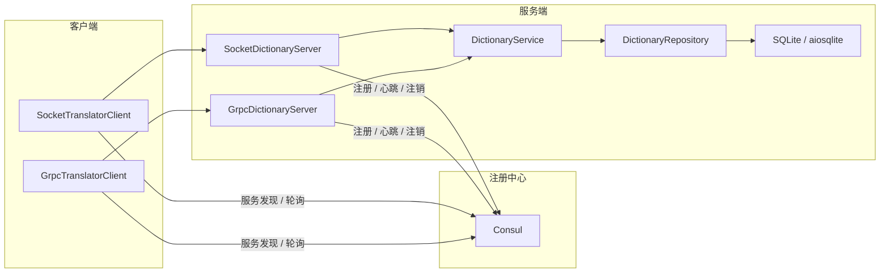
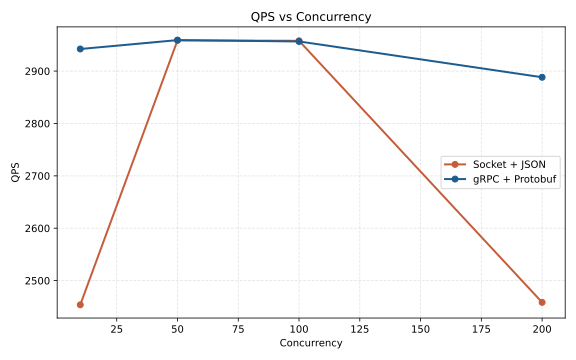
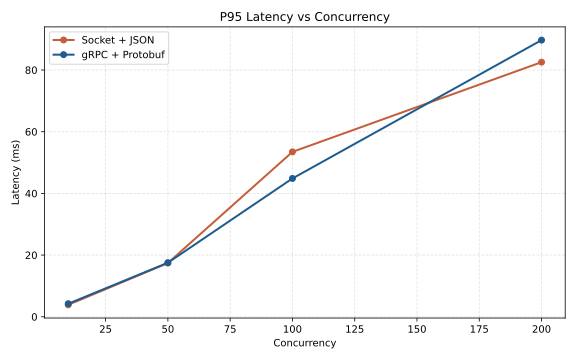
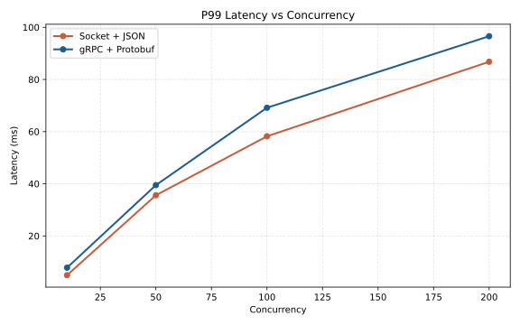
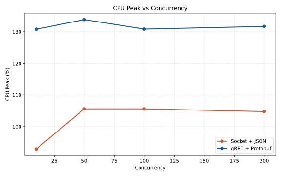
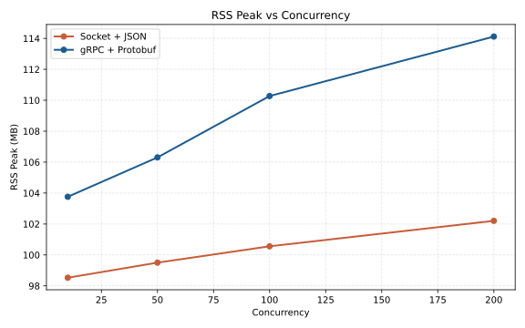
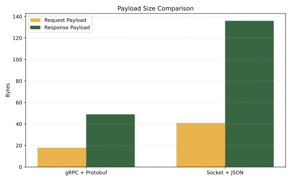

# 分布式系统-实验报告

## 摘要

本实验实现了一套“双协议分布式远程词典实验系统”，使用 `Socket + JSON` 与 `gRPC + Protobuf` 两种通信方案，在统一业务逻辑、统一词典数据和统一异步并发模型下开展对比实验。系统同时接入 `Consul` 作为注册中心，补齐服务注册、服务发现、TTL 心跳、优雅停机注销、Round Robin 负载均衡、指数退避重试和简单熔断等服务治理能力。

实验结果表明，在本次单机（用单机模拟分布式系统，硬件条件有限） Python 课程实验环境中，`gRPC + Protobuf` 在有效载荷体积方面优势明显，请求报文与响应报文分别比 `Socket + JSON` 缩小约 `56.10%` 与 `63.97%`；在 `10` 与 `200` 并发下，gRPC 的 QPS 也更高。但在 `50` 至 `200` 并发区间内，Socket 方案的平均延迟和部分尾延迟指标并不落后，且 CPU 与 RSS 开销更低。这说明在轻业务、单机部署、Python 运行时主导开销的场景中，协议编码效率并不会直接等价为端到端尾延迟优势，协议栈复杂度、连接复用方式与客户端实现策略同样会显著影响最终结果。

## 零、项目复现与环境搭建

### 0.1 环境要求

- Linux
- `bash`
- `curl`
- `unzip`
- Conda 或 Miniconda
- Python `3.11`

### 0.2 获取项目与创建环境

```bash
git clone <repository-url> distribute-lab1
cd distribute-lab1

conda activate base
conda env create -f environment.yml
conda activate dist-lab-py311
```

如果环境已经存在，可直接更新依赖：

```bash
conda activate base
conda activate dist-lab-py311
pip install -e '.[dev]'
```

### 0.3 一键复现实验

项目提供了一键脚本 [`scripts/run_local_experiment.sh`](scripts/run_local_experiment.sh)，会自动完成以下工作：

- 激活 Conda 环境
- 安装项目依赖
- 检查并下载 Consul 二进制
- 启动本地 Consul dev agent
- 启动 Socket 与 gRPC 服务
- 等待服务注册成功
- 运行 `ruff`、`mypy`、`pytest`
- 运行多并发 benchmark，并导出 JSON、CSV、Markdown 与 SVG 图表
- 在脚本退出时自动清理服务进程

执行方式如下：

```bash
conda activate base
conda activate dist-lab-py311

./scripts/run_local_experiment.sh
```

如需调整压测规模，可通过环境变量覆盖默认值：

```bash
TOTAL_REQUESTS=3000 \
CONCURRENCIES=10,50,100,200 \
RUNS=2 \
OUTPUT_DIR=benchmark/results/report \
./scripts/run_local_experiment.sh
```

### 0.4 分步复现实验

#### 方式 A：使用本地 Consul dev agent

如果本机尚未安装 Consul，可下载官方二进制：

```bash
mkdir -p .local/bin .local/tmp
curl -L -o .local/tmp/consul_1.21.2_linux_amd64.zip \
  https://releases.hashicorp.com/consul/1.21.2/consul_1.21.2_linux_amd64.zip
unzip -o .local/tmp/consul_1.21.2_linux_amd64.zip -d .local/bin
chmod +x .local/bin/consul
```

启动 Consul：

```bash
./.local/bin/consul agent \
  -dev \
  -client=127.0.0.1 \
  -bind=127.0.0.1 \
  -data-dir=.local/consul-data \
  -node=dist-lab-dev
```

#### 方式 B：使用 Docker Compose

如果实验环境具备 Docker，可直接使用 [`deploy/docker-compose.yml`](deploy/docker-compose.yml)：

```bash
docker compose -f deploy/docker-compose.yml up -d
```

该文件同时提供了 `toxiproxy`，用于后续扩展网络抖动、延迟和丢包实验。

#### 启动两种服务

启动 Socket 服务：

```bash
dist-lab run-socket-server \
  --host 127.0.0.1 \
  --advertise-host 127.0.0.1 \
  --port 50051 \
  --service-name remote-dictionary \
  --db-path data/socket_dictionary.db \
  --seed-path data/dictionary_seed.json \
  --consul-host 127.0.0.1 \
  --consul-port 8500
```

启动 gRPC 服务：

```bash
dist-lab run-grpc-server \
  --host 127.0.0.1 \
  --advertise-host 127.0.0.1 \
  --port 50052 \
  --service-name remote-dictionary \
  --db-path data/grpc_dictionary.db \
  --seed-path data/dictionary_seed.json \
  --consul-host 127.0.0.1 \
  --consul-port 8500
```

检查服务注册状态：

```bash
curl -s "http://127.0.0.1:8500/v1/health/service/remote-dictionary?passing=true"
```

如果系统正常，应该看到两个健康实例，一个 `protocol=socket-json`，一个 `protocol=grpc`。

#### 运行规范检查与测试

```bash
ruff check .
mypy .
pytest -q
```

#### 运行多并发 benchmark

先获取服务 PID：

```bash
pgrep -af "dist-lab run-(socket|grpc)-server"
```

再执行：

```bash
dist-lab benchmark-matrix \
  --service-name remote-dictionary \
  --queries hello,world,distributed,system,grpc,socket,network,performance,consistency,client,server,registry \
  --total-requests 3000 \
  --concurrencies 10,50,100,200 \
  --runs 2 \
  --warmup-requests 5 \
  --socket-server-pid <SOCKET_SERVER_PID> \
  --grpc-server-pid <GRPC_SERVER_PID> \
  --output-dir benchmark/results/report
```

### 0.5 复现产物位置

正式 benchmark 产物保存在：

- `benchmark/results/report/raw_results.json`
- `benchmark/results/report/raw_results.csv`
- `benchmark/results/report/raw_results.md`
- `benchmark/results/report/aggregate_results.json`
- `benchmark/results/report/aggregate_results.csv`
- `benchmark/results/report/aggregate_results.md`
- `benchmark/results/report/qps.svg`
- `benchmark/results/report/p95_latency.svg`
- `benchmark/results/report/p99_latency.svg`
- `benchmark/results/report/cpu_peak.svg`
- `benchmark/results/report/rss_peak.svg`
- `benchmark/results/report/payload_size.svg`

## 一、实验目的

本实验围绕“协议差异”与“服务治理差异”两个主题展开，目标如下：

1. 在统一业务语义下分别实现 `Socket + JSON` 与 `gRPC + Protobuf` 两套远程词典服务。
2. 通过注册中心将客户端与服务端解耦，使“服务调用”从固定地址调用转变为基于服务名的动态发现。
3. 使用统一压测工具量化比较两种协议在吞吐、延迟、资源开销和有效载荷大小上的差异。
4. 在实现过程中观察一致性、性能、复杂度和工程可维护性之间的取舍关系。

## 二、实验内容

本次实验完成了以下模块：

1. 抽象基类 `BaseTranslator`，统一两种协议的客户端调用接口。
2. `Socket + JSON` 自定义协议栈，采用 `4-byte length header + JSON body` 实现应用层 framing，并手动处理 TCP 粘包与半包。
3. `gRPC + Protobuf` 服务与客户端，使用 `.proto` 定义强类型契约。
4. `Consul` 注册中心接入，实现实例自动注册、TTL 心跳续约、服务发现与优雅停机注销。
5. 客户端服务治理能力，包括短 TTL 发现缓存、Round Robin 负载均衡、`tenacity` 指数退避重试和 `aiobreaker` 熔断。
6. 基于 `asyncio` 与 `aiosqlite` 的异步服务端与异步数据访问。
7. Benchmark 模块，支持多并发、多轮运行、结果聚合、图表导出与报告素材生成。
8. 覆盖协议解析、注册中心、服务发现、端到端调用、benchmark 汇总导出等核心功能的自动化测试。

## 三、技术方案

### 3.1 整体架构设计

系统采用“统一业务内核，双协议网络入口，注册中心统一治理”的结构。Socket 与 gRPC 共用词典业务逻辑和 SQLite 数据层，差异仅保留在网络协议、编解码方式和客户端连接策略上。



### 3.2 引入注册中心的意义

注册中心的作用不只是“记录地址”，更重要的是完成以下解耦：

- 让客户端只依赖服务名，不依赖固定 IP/端口，便于后续扩容与实例替换。
- 让服务端在启动时自注册、退出时自注销，避免静态配置漂移。
- 让健康检查成为路由前置条件，客户端只拿到健康实例。
- 为负载均衡、故障摘除、多副本扩展和后续治理实验预留统一入口。

换言之，注册中心把“调用谁”从代码静态写死变成了运行期决策，这正是微服务治理中最关键的解耦点之一。

### 3.3 协议定义

#### 3.3.1 gRPC 协议

`shared/translator.proto` 定义如下：

```proto
syntax = "proto3";

package translator;

service RemoteDictionary {
  rpc Translate(TranslateRequest) returns (TranslateResponse);
  rpc Health(HealthRequest) returns (HealthResponse);
}

message TranslateRequest {
  string request_id = 1;
  string word = 2;
}

message TranslateResponse {
  string request_id = 1;
  string word = 2;
  string translation = 3;
  string protocol = 4;
  string provider = 5;
  bool found = 6;
}
```

#### 3.3.2 Socket 协议

Socket 方案采用自定义应用层帧格式：

```text
+----------------------+----------------------+
| 4-byte body length   | JSON body bytes      |
+----------------------+----------------------+
| big-endian unsigned  | UTF-8 JSON payload   |
+----------------------+----------------------+
```

例如，一个请求帧由两部分组成：

1. 长度头：4 字节大端无符号整数，表示 JSON body 的字节长度。
2. 包体：JSON 对象，例如 `{"request_id":"...","word":"hello"}`。

这种设计的优点是实现简单、帧边界明确；缺点是需要手动处理粘包、半包、非法长度和异常输入。

### 3.4 服务端实现

服务端统一采用 `asyncio` 并发模型，数据访问层使用 `aiosqlite`，避免阻塞主事件循环。Socket 与 gRPC 共享 `DictionaryService` 业务逻辑，并通过 `RegistryLifecycle` 管理注册、心跳和注销。

服务端生命周期的核心逻辑如下：

```python
class RegistryLifecycle:
    async def start(self) -> None:
        await self._registry.register(
            self._instance,
            ttl_seconds=self._ttl_seconds,
            deregister_after_seconds=self._deregister_after_seconds,
        )
        await self._registry.heartbeat(self._instance.check_id)
        self._heartbeat_task = asyncio.create_task(self._heartbeat_loop())

    async def stop(self) -> None:
        self._stop_event.set()
        if self._heartbeat_task is not None:
            self._heartbeat_task.cancel()
            with contextlib.suppress(asyncio.CancelledError):
                await self._heartbeat_task
        with contextlib.suppress(Exception):
            await self._registry.deregister(self._instance.instance_id)
        await self._registry.close()
```

这部分设计体现了两个目标：

- 启动即注册，确保实例只在真正可用时才进入服务列表。
- 退出即注销，避免客户端继续命中过期实例。

### 3.5 客户端实现与服务治理

客户端在协议调用之外，还承担了“服务治理适配层”的职责。治理能力主要由四部分组成：

1. `DiscoveryCache`：为发现结果增加短 TTL 缓存，降低注册中心压力。
2. `RoundRobinLoadBalancer`：在多个健康实例之间轮询分发。
3. `tenacity`：遇到可重试异常时执行指数退避重试。
4. `aiobreaker`：连续故障达到阈值后打开熔断器，避免故障放大。

高并发时最关键的一处优化在于发现请求折叠：

```python
async def resolve(
    self, service_name: str, protocol: ProtocolType
) -> list[ServiceInstance]:
    key = f"{service_name}:{protocol.value}"
    now = time.monotonic()

    async with self._lock:
        cached = self._cache.get(key)
        if cached is not None and cached[0] > now:
            return list(cached[1])
        inflight = self._inflight.get(key)
        if inflight is None:
            inflight = asyncio.create_task(
                self._registry.discover(service_name, protocol)
            )
            self._inflight[key] = inflight

    instances = await inflight
```

这里采用“短 TTL 缓存 + 单飞请求”的组合策略。缓存 miss 时，只允许一个协程真正访问 Consul，其余协程复用同一任务结果。这样可以显著减少高并发下对注册中心的瞬时冲击。

### 3.6 核心功能实现说明

#### 3.6.1 Socket 粘包与半包处理

Socket 方案的关键难点在于帧边界识别。`FrameBuffer` 使用单个累积缓冲区，在拿到完整的“长度头 + 包体”之前不会消费数据：

```python
while True:
    if len(self._buffer) < HEADER_SIZE:
        return messages

    body_length = HEADER_STRUCT.unpack_from(self._buffer, 0)[0]
    frame_length = HEADER_SIZE + body_length
    if len(self._buffer) < frame_length:
        return messages

    body = bytes(self._buffer[HEADER_SIZE:frame_length])
    del self._buffer[:frame_length]
    messages.append(decode_json_body(body))
```

这一实现可以稳定处理以下情况：

- 一个完整帧被拆成多个 TCP 包到达
- 多个完整帧被合并在同一次 `read` 中到达
- 收到非法长度头或超大包时立即拒绝

#### 3.6.2 双协议共享业务逻辑

词典翻译逻辑全部收敛到 `DictionaryService` 中，Socket 与 gRPC 只是不同的网络入口。这种设计避免了“协议实现差异掺杂业务差异”，使 benchmark 更接近对协议栈本身的比较。

#### 3.6.3 连接策略差异

当前实现中，两种客户端采用了不同的连接复用方式：

- `SocketTranslatorClient` 每次请求新建 TCP 连接，请求完成后关闭。
- `GrpcTranslatorClient` 以 `endpoint` 为粒度缓存 channel 与 stub，复用已有 HTTP/2 连接。

这也是实验结果中一个值得注意的影响因素。gRPC 在轻业务场景下虽然协议栈更复杂，但连接复用带来的收益抵消了部分额外开销；Socket 方案虽然路径更短，但频繁建连会在高并发下影响稳定性。

### 3.7 压测模块设计

`benchmark` 模块以 `PerformanceAnalyzer` 为核心，采集并导出以下指标：

- `QPS`
- `Avg Latency`
- `P95 Latency`
- `P99 Latency`
- `CPU Peak`
- `RSS Peak`
- `Request Payload Size`
- `Response Payload Size`

为了支持课程实验报告输出，又额外实现了：

- 多并发矩阵运行
- 多轮结果聚合
- JSON / CSV / Markdown 导出
- SVG 图表自动生成

## 四、实验运行结果

### 4.1 实验条件

本次正式 benchmark 于 `2026-04-10` 完成，实验条件如下：

- Python `3.11`
- Conda 独立环境 `dist-lab-py311`
- Consul `1.21.2` 本地 dev agent
- Socket 服务端口：`50051`
- gRPC 服务端口：`50052`
- 查询词集：`hello, world, distributed, system, grpc, socket, network, performance, consistency, client, server, registry`
- 每组总请求数：`3000`
- 并发级别：`10 / 50 / 100 / 200`
- 每种协议每个并发级别运行 `2` 轮
- 每轮正式测试前执行 `5` 次 warmup

### 4.2 聚合结果表

正式实验聚合结果如下：

| Protocol | Concurrency | Runs | Requests | Avg QPS | Avg(ms) | Avg P95(ms) | Avg P99(ms) | Avg CPU Peak(%) | Avg RSS Peak(MB) | Req Payload(B) | Resp Payload(B) |
|----------|-------------|------|----------|---------|---------|-------------|-------------|-----------------|------------------|----------------|-----------------|
| grpc | 10 | 2 | 3000 | 2942.22 | 2.94 | 4.24 | 7.82 | 130.80 | 103.76 | 18 | 49 |
| grpc | 50 | 2 | 3000 | 2959.15 | 13.39 | 17.52 | 39.49 | 133.85 | 106.30 | 18 | 49 |
| grpc | 100 | 2 | 3000 | 2956.57 | 27.11 | 44.85 | 69.16 | 130.85 | 110.27 | 18 | 49 |
| grpc | 200 | 2 | 3000 | 2888.21 | 56.95 | 89.69 | 96.59 | 131.70 | 114.12 | 18 | 49 |
| socket-json | 10 | 2 | 3000 | 2453.76 | 3.21 | 3.88 | 4.95 | 92.90 | 98.53 | 41 | 136 |
| socket-json | 50 | 2 | 3000 | 2958.70 | 12.18 | 17.43 | 35.61 | 105.60 | 99.50 | 41 | 136 |
| socket-json | 100 | 2 | 3000 | 2957.85 | 25.61 | 53.46 | 58.21 | 105.60 | 100.56 | 41 | 136 |
| socket-json | 200 | 2 | 3000 | 2458.42 | 50.66 | 82.55 | 86.80 | 104.75 | 102.21 | 41 | 136 |

原始逐轮结果见：

- [`benchmark/results/report/raw_results.md`](benchmark/results/report/raw_results.md)
- [`benchmark/results/report/aggregate_results.md`](benchmark/results/report/aggregate_results.md)

### 4.3 图表

#### QPS 对比



#### P95 延迟对比



#### P99 延迟对比



#### CPU 峰值对比



#### RSS 峰值对比



#### 有效载荷大小对比



### 4.4 结果分析

#### 1. 吞吐量

- 在 `10` 并发下，gRPC 平均 QPS 为 `2942.22`，比 Socket 的 `2453.76` 高约 `19.91%`。
- 在 `50` 与 `100` 并发下，两者吞吐基本持平。
- 在 `200` 并发下，gRPC 仍保持 `2888.21` QPS，Socket 则降到 `2458.42`，gRPC 高约 `17.48%`。

这说明在高并发和多请求复用场景下，gRPC 的连接复用能力带来了更稳定的吞吐表现。

#### 2. 延迟分布

- `10` 并发下，gRPC 平均延迟略低，但 P99 高于 Socket。
- `50` 并发下，Socket 的平均延迟和尾延迟略优于 gRPC。
- `100` 并发下，Socket 平均延迟更低，但 P95 高于 gRPC，P99 则低于 gRPC。
- `200` 并发下，Socket 在 Avg / P95 / P99 三个指标上均优于 gRPC。

这组结果说明：在本次“单机、轻业务、Python 运行时主导”的实验条件下，Protobuf 编码带来的字节节省，并没有完全转化为端到端尾延迟优势。gRPC 引入的 HTTP/2、运行时调度与协议栈开销，在高并发下仍会体现在尾延迟中。

#### 3. 资源开销

- gRPC 的 CPU 峰值始终高于 Socket，增幅大约在 `23%` 到 `41%` 之间。
- gRPC 的 RSS 峰值也持续高于 Socket，增幅大约在 `5%` 到 `12%` 之间。

这与 gRPC 更完整的协议栈、channel 管理和序列化运行时开销是一致的。

#### 4. 传输效率

- Socket 请求报文：`41 B`
- gRPC 请求报文：`18 B`
- Socket 响应报文：`136 B`
- gRPC 响应报文：`49 B`

按当前实验样本计算，gRPC 的请求与响应有效载荷分别缩小约 `56.10%` 和 `63.97%`。这部分优势在跨机网络传输、广域网场景和更大消息体中通常会更明显。

## 五、实验验证结果

### 5.1 自动化测试结果

项目共编写 `16` 个自动化测试用例，覆盖协议解析、注册中心、服务发现、容错机制、benchmark 汇总和双协议端到端调用。最终执行结果如下：

```bash
ruff check .
mypy .
pytest -q
```

实际结果：

- `ruff check .` 通过
- `mypy .` 通过
- `pytest -q` 结果为 `16 passed`

### 5.2 主要验证项说明

| 验证项 | 测试目的 | 预期结果 | 实际结果 |
|--------|----------|----------|----------|
| Socket 半包处理 | 验证协议缓冲区能等待剩余字节到齐后再解包 | 首段输入不返回消息，补齐后得到完整 JSON | 测试通过 |
| Socket 粘包处理 | 验证一次读取多个帧时能拆出多条消息 | 两条消息均被正确解析 | 测试通过 |
| 超大包拒绝 | 验证非法长度头会被及时拦截 | 抛出 `ProtocolError` | 测试通过 |
| SQLite 数据装载 | 验证词典种子文件能异步写入数据库并完成查询 | 已知单词返回译文，未知单词返回空值 | 测试通过 |
| Consul 注册/发现/注销 | 验证注册中心交互逻辑正确 | 完成注册、心跳、发现与注销 | 测试通过 |
| Round Robin | 验证负载均衡按顺序轮转实例 | 多次调用按实例顺序轮询 | 测试通过 |
| 发现请求折叠 | 验证缓存 miss 时不会并发打爆注册中心 | 20 个并发解析只触发 1 次 `discover` | 测试通过 |
| 指数退避重试 | 验证暂时性故障可以重试恢复 | 前两次失败，第三次成功返回 | 测试通过 |
| 熔断机制 | 验证连续失败后客户端不再持续压测故障节点 | 熔断器进入 `OPEN` | 测试通过 |
| Socket 端到端调用 | 验证 Socket 服务与客户端整体链路可用 | 已知词返回译文，未知词返回缺省文案 | 测试通过 |
| gRPC 端到端调用 | 验证 gRPC 服务与客户端整体链路可用 | 已知词返回译文，未知词返回缺省文案 | 测试通过 |
| Benchmark 导出 | 验证聚合、Markdown、CSV、JSON 和 SVG 图表导出 | 所有文件成功生成 | 测试通过 |

### 5.3 运行期验证

除自动化测试外，还补充了两项运行期验证：

#### 1. 服务注册与健康检查

实际运行服务后，访问：

```bash
curl -s "http://127.0.0.1:8500/v1/health/service/remote-dictionary?passing=true"
```

实际结果为两个 `passing` 实例：

- `remote-dictionary-socket-json-127.0.0.1-50051`
- `remote-dictionary-grpc-127.0.0.1-50052`

这说明服务注册、TTL 心跳与按协议过滤发现链路工作正常。

#### 2. 优雅停机与注销

在 benchmark 完成后，向两个服务发送中断信号，再次查询健康实例列表：

```bash
curl -s "http://127.0.0.1:8500/v1/health/service/remote-dictionary?passing=true"
```

实际返回：

```json
[]
```

这说明优雅停机阶段已经成功触发注销逻辑，客户端不会再发现已经退出的实例。

## 六、局限性与改进方向

本次实验已经能够支撑课程要求，但仍存在以下局限：

1. 当前实验主要在单机环境完成，尚未覆盖真正跨主机部署时的网络抖动、拥塞与序列化传输差异。
2. Socket 客户端当前采用“每次请求新建连接”的策略，如果引入连接池或长连接复用，性能结果还会发生变化。
3. gRPC 方案使用的是 Python 运行时，若切换为 Go、Rust 或 C++，Protobuf 与 HTTP/2 的优势可能更明显。
4. 资源采样以进程级 `CPU Peak / RSS Peak` 为主，尚未纳入更完整的监控指标，例如事件循环阻塞时间、GC 影响和系统调用分布。
5. `toxiproxy` 已经在部署文件中预留，但本报告尚未把网络故障仿真实验纳入正式结果。

后续可沿以下方向继续扩展：

- 为 Socket 客户端增加连接池与批量请求能力
- 为 gRPC 接入 streaming 或健康检查标准协议
- 接入 Prometheus + Grafana 完成更细粒度可观测性
- 在多副本场景下补充真实的 Round Robin 与故障剔除实验
- 借助 `toxiproxy` 系统性模拟延迟、丢包和抖动

## 七、关键文件说明

| 路径 | 作用 |
|------|------|
| `shared/base.py` | 定义统一的 `BaseTranslator` 抽象接口 |
| `shared/translator.proto` | 定义 gRPC 服务契约 |
| `shared/socket_protocol.py` | 定义 Socket 帧编码、解码与缓冲区解析逻辑 |
| `registry/consul.py` | 实现 Consul 注册、发现、心跳与注销 |
| `server/lifecycle.py` | 实现服务注册生命周期与 TTL 心跳 |
| `server/socket_server.py` | Socket 服务端入口 |
| `server/grpc_server.py` | gRPC 服务端入口 |
| `server/repository.py` | 基于 `aiosqlite` 的异步词典存储层 |
| `server/service.py` | 双协议共享的词典业务逻辑 |
| `client/discovery.py` | 发现缓存、单飞请求与 Round Robin 负载均衡 |
| `client/base.py` | 重试、熔断、服务发现客户端基类 |
| `client/socket_client.py` | Socket 客户端实现 |
| `client/grpc_client.py` | gRPC 客户端实现 |
| `benchmark/analyzer.py` | 核心压测逻辑与指标计算 |
| `benchmark/reporting.py` | benchmark 聚合、导出与图表生成 |
| `scripts/cli.py` | 命令行入口，包括服务启动与 benchmark-matrix |
| `scripts/run_local_experiment.sh` | 一键复现实验脚本 |
| `tests/` | 核心功能自动化测试 |

## 八、总结

本实验不仅实现了双协议远程词典服务，也把服务注册与发现、心跳健康检查、优雅停机、客户端容错和量化 benchmark 组织成了一套完整的分布式实验链路。对比结果显示，gRPC 在报文体积和部分吞吐场景下更有优势，Socket 方案则在实现路径、资源开销和部分延迟指标上保持竞争力。

从课程实验角度看，这个系统能够比较完整地体现两类通信方案在“开发复杂度、协议表达能力、运行性能、服务治理接入成本”上的差异，也为后续继续扩展多副本部署、网络故障仿真和更复杂业务负载提供了可复用基础。
